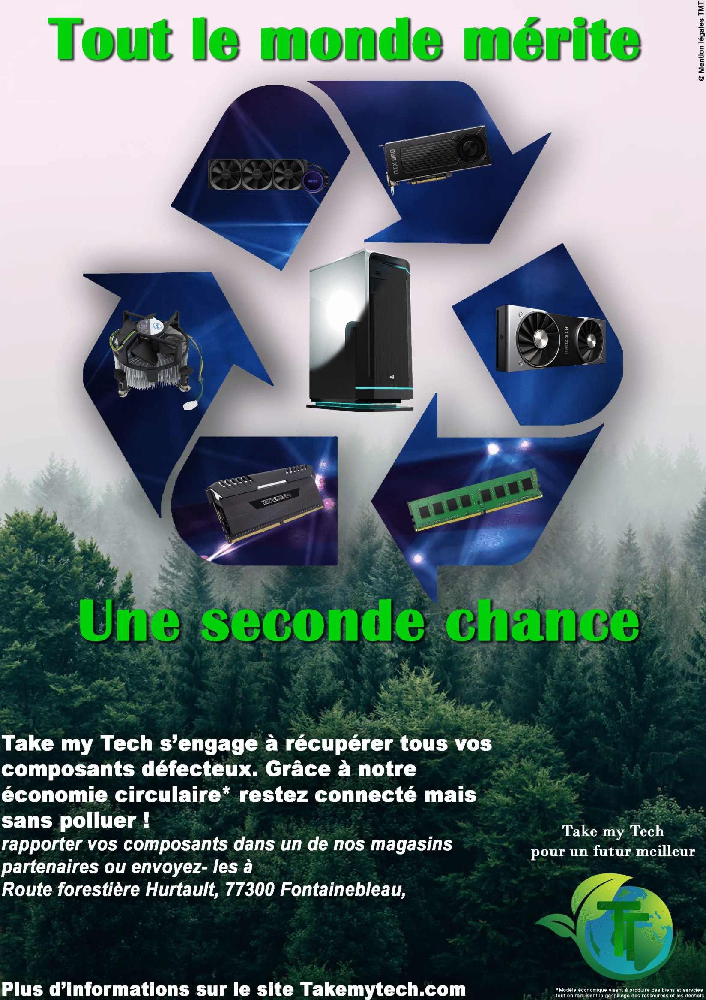
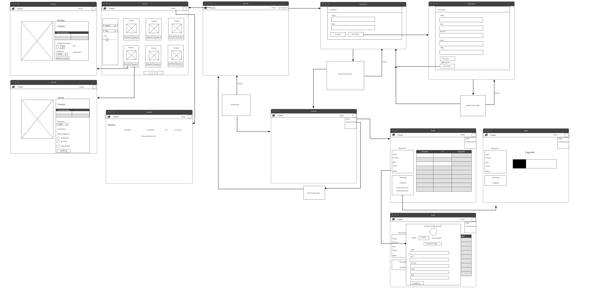

# Projet SAE 2.02
***Développement Web***
>- Introduction Sujet
>
>- Structure Générale
>
>- Conclusion

## Introduction

***Le projet***

Ce projet est en lien avec les SAE 2.05 et 2.06, lors desquelles nous avons imaginé une entreprise fictive sur le principe de l'économie circulaire et avons créé des affiches de publicité pour cette entreprise.
Le site est disponible sur cette [page](https://dwarves.iut-fbleau.fr/~justine/Sae/Accueil.php) .

**Affiche**



```
Ici le contexte fournit pour la réalisation de la suite du projet

Une entreprise se charge de faire l'intermédiaire entre les particuliers 
et des entreprises (B2C) pour la vente de matériel électronique (téléphone,
tablette, ordinateur, objets connectés, ...) et la reprise de matériel
usagé. L'entreprise n'est pas un simple intermédiaire. Sa valeur ajoutée
repose principalement sur sa capacité à recycler le matériel électronique
en récupérant des éléments valorisables, que ce soit des métaux précieux ou
des composants qui pourront être reconditionnés (batterie, écran tactile,
disque ssd, RAM etc).

 +-----------+   vente (usagé)       +------------------+
 |  Client   | ------------------->  |                  |
 |           | <-------------------  + Entreprise B2C   |
 +-----------+   achat               |                  |
                 (neuf, recond)      |                  |
                                     |                  |
                                     |                  |
                  achat composants   |                  |
 +-------------+ <------------------ |                  |
 | Constructeur|                     |                  |
 | Samsung etc | ---------------->   |                  |
 |             | vente (neuf, recond)|                  |
 +-------------+                     +------------------+
```

L'objectif de ce projet est la réalisation du site web de notre entreprise avec le contexte décrit ci-dessus, permettant à un client d'interagir avec l'entreprise et suivre l'évolution de ces interactions.

Le client peut s'inscrire et se connecter, sur sa page de profil il peut retrouver sa cagnotte qui évolue en fonction des ses interactions sur le site. Il peut vendre des objets à l'entreprise afin qu'ils soient reconditionnés, où en acheter de nouveaux neufs ou d'occasion, ce qui lui permet de faire évoluer sa cagnotte. 


***Groupe de travail***

Notre groupe de travaille est composé de:
> Lucas JUSTINE
>
> Claire GOBERT
>
> Victor DESCAMPS
>
> Lucas WATTIN
> 
>~~Thomas BOUCHET~~

Le groupe initial du projet pour les SAE 2.05 et 2.06 était composé de Lucas J, Claire, Victor et Thomas Bouchet. Ce dernier a par la suite démissionné.
En ce qui me concerne, j'ai commencé les SAE avec ~~Analia Blein~~ et ~~Jean David Zouzoua~~, mais ces personnes ont également démissionnés, et j'ai donc demandé à rejoindre ce groupe afin de ne pas faire le projet seul.
Vous pouvez retrouver le début de mon travail à l'[adresse](https://dwarves.iut-fbleau.fr/~wattin/Site/main.html) ainsi que sur mon [git](https://dwarves.iut-fbleau.fr/gitiut/wattin/BUT1-SAE-2.02-WATTIN.git) .


## Structure générale

### Fichier

**Connexion**

> ***Ce qui fonctionne :***
>
> Connexion avec un login et mot de passe 
> Gestion des erreurs de login et mot de passe 

>
> ***Ce qui ne fonctionne pas :*** 
>
> Pas de bouton "se souvenir de moi" 

**Inscription**

> ***Ce qui fonctionne :***
>
> Inscription avec un mot de passe hasher 
> Gestion des erreurs dans le nom,prenom,login...

> ***Ce qui ne fonctionne pas :***
>
> Pas de confirmation du mot de passe 

**Produit**

> ***Ce qui fonctionne :***
>
> affichage dynamique filtre, produit
> Pagination
> Gestion erreurs changement nom/valeur bouton,filtre,valeur négative du prix

> ***Ce qui ne fonctionne pas :***
>
> Pas de filtre par nom
> Pagination non réduite si trop de page
> Si changement id 

**Profil**

> ***Ce qui fonctionne :***
>
> Affichage éléments recyclés 
> Historique vente/achat 
> Cagnotte 
> Mofication mot de passe


### Travail Technique

Dans cette partie, chaque membre explique ce qu'il a fait. 

>- **Lucas WATTIN** :
>
> Pour la page d'achat et de vente (une fois le produit séléctionné), j'ai commencé à la créer et Lucas Justine l'a finalisée.
> J'ai rempli la base de donnée avec Victor, principalement ce qui concerne les produits.
> J'ai fais le rapport avec Lucas Justine.

>- **Claire GOBERT** :
>
> Pour la page d'accueil, j'ai réalisé une bannière de publicité en utilisant des requêtes, une requête SQL classique pour récupérer des informations de base comme le nom ou la marque du produit. Et une requête préparée pour toutes les caractéristiques du produit. Pour le reste de la page, ce sont des articles expliquant le but du fonctionnement de l'entreprise, notamment de son modèle économique.
>
Langages utilisés :
    -Php
    -Html
    -Css

>- **Victor DESCAMPS** :
>
> Pour la page produite j'ai créé les tries de prix/marque/type en utilisant des requêtes préparées et des ajouts de conditions afin d'afficher seulement les éléments souhaités( mais la mise en page a été faite par Lucas Justine).
> J'ai aussi rempli avec Lucas Wattin la base de données.
>
Langages utilisés :
	-Php 
    -html (très légèrement)

>- **Lucas JUSTINE** : 
>
> Pour chaque page utilisant une donnée venant de l'extérieur, j'ai utilisé des requêtes préparées afin d'éviter le injections.
> De plus, j'ai filtré certaines données pour avoir une forme souhaitée. J'ai aussi essayé de faire passer le moins de variable possible pour les post ou formulaires afin d'éviter la modification de valeur. 
>>**Exemple** : Login 
>
> Ne pouvant expliqué rapidement ce que j'ai fais , j'ai donc indiqué au debut de chaque fichier mon nom pour signalé que j'ai réaliser celui-ci.
>
Langages utilisés :
	-Php 
	-Html
	-Javascript


## Conclusion


***Conclusions personnelles***


**Claire Gobert**

>C'était un projet intéressant, le travail a été réparti de manière convenable, chacun d'entre nous c'est principalement occupé d'une page du site. Même s'il aurait peut-être été plus intéressant de ce répartir les tâches différemment, de sorte à ce que chacun puisse travailler de manière équivalente sur les parties les plus techniques.

**Victor Descamps**

>J'ai personnelement apprécié le projet et je ne vois pas vraiment quoi dire ici, dans le groupe tout le monde n'a pas donné autant d'effort personne n'a rien fait et il n'y a jamais eu de mauvaise ambiance lors de la création du site.

**Lucas Wattin**

J'ai trouvé le projet très complet et intéressant. La principale difficulté a été de rejoindre un nouveau groupe mais l'adaptation a été rapide et il y avait une bonne ambiance de groupe, même si nous aurions pu répartir le travail différement. Le rendu final du site correspond à nos espérances.

**Lucas Justine**

> J'ai trouvé que le projet était très amusant a réaliser même si ayant fait la plus grande partie, 
> je trouve que c'était plutôt long pour 1 personne. 
> J'ai essayé de faire au mieux pour rendre mon code lisible. 
> J'ai eu un peu de mal à faire du javascript, je ne sais pas si ma méthode est la bonne ou si c'est juste du bricolage. J'ai aussi utilisé du code sur internet que je modifié pour mon code pour le panier pour le rendre plus propre et compréhensif avec les fonctions. [ici](https://jcrozier.developpez.com/articles/web/panier/)
>  Pour la partie produit, j'ai essayé de gérer au mieux les erreurs, même je n'ai pas pu en gérer certaines. 
>> Si l'utilisateur modifie la valeur du bouton ***Acheter*** ou ***Ajouter au panier***, il ne vas pas ce retrouver sur la bonne page ou peut même ajouter au panier un autre produit que celui choisi.
>
>J'ai aussi essayé de ne mettre le moins de **données externe** dans la session afin d'éviter de faussé ces même données comme le prix par exemple 


***Conclusion commune***

Pour conclure, nous pouvons dire que le sujet de la saé nous a beaucoup plu, nous avons rendu projet sans souci au niveau du temps, grâce à notre organisation.

## Annexes ##

***Cas de test***

*Cas de test 1: Inscription*

- Se rendre sur le site
- Cliquer dans la barre de navigation sur le bouton "Se Connecter"
- Cliquer sur le bouton "Inscription"
- Remplir les informations demandées
- Finaliser en appuyant sur le bouton "S'inscrire"

*Cas de test 2: Connexion*

- Se rendre le site
- Cliquer dans la barre de navigation sur le bouton "Se Connecter"
- Remplir les informations demandées
- Se connecter en cliquant sur "Se Connecter"


*Cas de test 3: Acheter*

- Se rendre sur le site
- Se connecter
- Cliquer sur le bouton "Produit" dans la barre de navigation
- Choisir le produit souhaité en cliquant sur "Acheter"
- Séléctionner le nombre de produit ainsi que l'entreprise à qui l'acheter
- Cliquer sur "Ajouter au panier"
- Cliquer sur "Panier" dans la barre de navigation
- Cliquer sur "Acheter"

*Cas de test 4: Vendre*

- Se rendre sur le site
- Se connecter
- Cliquer sur le bouton "Produit" dans la barre de navigation
- Choisir le produit à vendre et cliquer sur "Vendre"
- Séléctionner l'entreprise à qui vendre le produit
- Séléctionner l'état du produit
- Cliquer sur "Confirmer"


*Cas de test 5: Achat sans argent*

- Ajout au panier d'un article avec une cagnotte inférieur au prix
- Erreur car l'utilisateur n'a pas assez d'argent 

*Cas de test 6: Modification filtres*

- Un utilisateur modifie les filtres dans l'url ou en changeant le code dans la page 
- Erreur
>Veuillez ne pas mettre n'importe quoi dans pour le filtrage des données

*Cas de test 7: Modifications prix vente*

- Un utilisateur essaye de modifier le prix de vente du produit
- Erreur
>Veuillez ne pas trafiquer les prix de vente.

*Cas de test 8: Ajout au panier élément indisponible*

- L'utilisateur modifie le code de la page html pour ajouter un produit non disponible, en activant le bouton et augmentant le maximum.
- Rien n'est ajouté au panier 

***Wireflow***

Un wireflow est un livrable permettant d'illustrer le parcours de l'utilisateur en fonction de ses interactions. Il représente la combinaison du wireframe et du user flow
Les deux wireflow se trouvent en annexe au format png 

**Premier wireflow** 


**Deuxième wireflow** 

>Le deuxième wireflow est juste l'ajout des autres pages qui n'avaient pas été mise dans le premier
>


